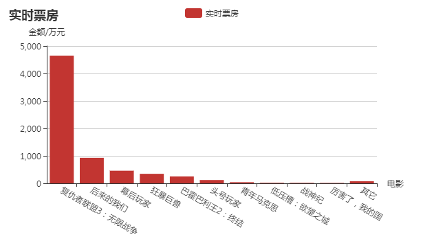

```
<script type="text/javascript">
         var myChart = echarts.init(document.getElementById('main'));
         // 显示标题，图例和空的坐标轴
         myChart.setOption({
             title: {
                 text: '实时票房'
             },
             tooltip: {},
             legend: {
                 data:['实时票房']
             },
             grid: {
             		y2:140
             },
             xAxis: {
             	 name:'电影',
                 data: [],
                 axisLabel: {
                 		interval: 0,
                 		rotate: -30
                 }
             },
             yAxis: {
             		type:'value',
					name:'金额/万元'
             },
             series: [{
                 name: '实时票房',
                 type: 'bar',
                 data: []
             }]
         });
         $.ajax({
         type : "get",
         async : true,            //异步请求
         url : "http://api.shenjian.io/",    
         data : {
         	appid: "dd648129b0e17057b8901c27f4a88021"
         },
         dataType : "jsonp",        //返回数据形式为json
         success : function(success) {
         	 var names=[];    //用来盛放X轴坐标值
        	 var nums=[];    //用来盛放Y坐标值
             //请求成功时执行该函数内容，result即为服务器返回的json对象
             for(var i=0;i<success.data.length;i++){       
                       names.push(success.data[i].MovieName);//遍历并填入类别数组
                       nums.push(success.data[i].BoxOffice);                    
                    myChart.setOption({        //加载数据图表
                        xAxis: {
                            data: names
                        },
                        series: [{
                            // 根据名字对应到相应的系列
                            name: '实时票房',
                            data: nums
                        }]
                    });
                    
             }
         
        },
        
    })
       </script>   
```
