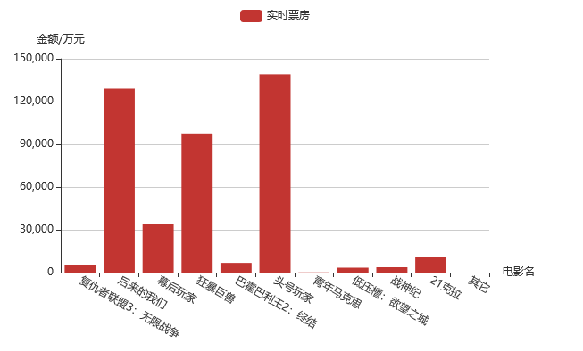

js源码：
```
<!DOCTYPE html>
<html>
<head>
<meta charset="utf-8">
<title>菜鸟教程(runoob.com)</title>

<script src="js/echarts.js"></script>
<script src="js/jquery.min.js"></script>
</head>
<body>
	<div id="main" style="width: 600px;height:400px;">
	</div>

</body>
<script type="text/javascript">
	  var myChart = echarts.init(document.getElementById('main'));
         myChart.setOption({
             tooltip: {},
             legend: {
                 data:['实时票房']
             },
             grid: {
             		y2:100
             },
             xAxis: {
             	 name:'电影名',
                 data: [],
                 axisLabel: {
                 		interval: 0,
                 		rotate: -30
                 }
             },
             yAxis: {
             		type:'value',
					name:'金额/万元'
             },
             series: [{
                 name: '实时票房',
                 type: 'bar',
                 data: []
             }]
         });
         $.ajax({
         type : "get",
         async : true, 
         url : "http://api.shenjian.io/",    
         data : {
         	appid: "dd648129b0e17057b8901c27f4a88021"
         },
         dataType : "jsonp",
         success : function(success) {
         	 var MovieName=[];    
        	 var sumBoxOffice=[]; 
             for(var Irank=0;Irank<success.data.length;Irank++){       
                       MovieName.push(success.data[Irank].MovieName);
                       sumBoxOffice.push(success.data[Irank].sumBoxOffice);                    
                    myChart.setOption({        //加载数据图表
                        xAxis: {
                            data: MovieName
                        },
                        series: [{
                            // 根据名字对应到相应的系列
                            name: '实时票房',
                            data:  sumBoxOffice
                        }]
                    });
             }
        },
    })


</script>

</html>
```
