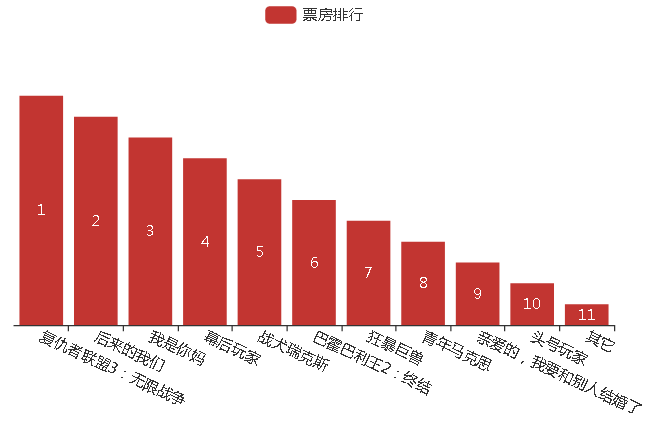

ajax的js代码如下所示：
```
function topJson(jsonUrl, jsonId, JsonType, JsonDataType) {
	$.ajax({
		type: JsonType,
		url: jsonUrl,
		data: {
			appid: jsonId
		},
		dataType: JsonDataType,
		success: function(data) {
			topClean(data);
		}
	});
}

function topClean(data) {
	var topData1 = [];
	var topData2 = [];
	for(var i = 0; i < data.data.length; i++) {
		topData1.splice(i, 0, data.data[i].Irank);
		topData2.splice(i, 0, data.data[i].MovieName);
	};
	topChart(topData1, topData2);
}
```
echarts的js代码如下所示：
```
function topChart(Data1, Data2) {
	var myChart = echarts.init(document.getElementById('top'));
	var option = {
		legend: {
			data: ['票房排行']
		},
		grid: {
			y2: 140
		},
		xAxis: {
			data: Data2,
			axisLabel: {
				interval: 0,
				rotate: -25
			}
		},
		yAxis: {
			show: false
		},
		series: [{
			data: Data1.sort(function(a, b) {
				return b - a
			}),
			type: 'bar',
			name: '票房排行',
			label: {
				normal: {
					show: true,
					formatter: function(value) {
						return Data1[value.value - 1]
					}
				}
			}
		}]
	};
	myChart.setOption(option);
}
```
